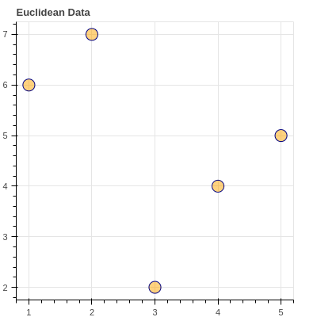


{{ if or .Page.Params.math .Site.Params.math }}

<!-- KaTeX -->
<link rel="stylesheet" href="https://cdn.jsdelivr.net/npm/katex@0.11.1/dist/katex.min.css" integrity="sha384-zB1R0rpPzHqg7Kpt0Aljp8JPLqbXI3bhnPWROx27a9N0Ll6ZP/+DiW/UqRcLbRjq" crossorigin="anonymous">
<script defer src="https://cdn.jsdelivr.net/npm/katex@0.11.1/dist/katex.min.js" integrity="sha384-y23I5Q6l+B6vatafAwxRu/0oK/79VlbSz7Q9aiSZUvyWYIYsd+qj+o24G5ZU2zJz" crossorigin="anonymous"></script>
<script defer src="https://cdn.jsdelivr.net/npm/katex@0.11.1/dist/contrib/auto-render.min.js" integrity="sha384-kWPLUVMOks5AQFrykwIup5lo0m3iMkkHrD0uJ4H5cjeGihAutqP0yW0J6dpFiVkI" crossorigin="anonymous" onload="renderMathInElement(document.body);"></script>

<script>
    document.addEventListener("DOMContentLoaded", function() {
        renderMathInElement(document.body, {
            delimiters: [
                {left: "$$", right: "$$", display: true},
                {left: "$", right: "$", display: false}
            ]
        });
    });
</script>

{{ end }}


The Graph Neural Network (GNN) was proposed ([Scarselli, 2008](https://ro.uow.edu.au/cgi/viewcontent.cgi?article=10501&context=infopapers)) as a general framework for defining deep neural networks on graph data.

(If you need a refresher on deep learning, see [here](https://www.youtube.com/watch?v=tutlI9YzJ2g))

The idea was to somehow utilize a deep neural network to generate node-embeddings in a generalize-able way to graph-structured data. The main idea in utilizing neural networks was that, apart from node features (degree, attributes, etc), the actual structure of the node's neighbourhood, and by extension the graph, should contribute somehow to the node embeddings.

This task is further complicated by the fact that typical deep-learning approaches (Convolutional and Recurrent Neural Networks) expect some form of data structured in the Euclidean plane (images or sequences of text). Hence, a completely new way of utilizing deep, multi-layer perceptrons was needed.





Before we go further, here are two concepts that are fairly significant to the field: Inductive and Transductive Learning

**Inductive learning** is what you'd think about as typical, supervised machine learning. This is where a model learns general rules from observed training data, which are then applied to test cases which are unseen during training. Although the model is exposed to a restricted scope of training data, it is expected to generalize by learning latent pattern present in a feature-target relationship. 

**Tranductive learning** uses both the training and testing data during the learning phase. In this case, the model is, for example, aware of test-node in a graph, but attempts to find information in the combined dataset for later use in predicting the unlabelled data points

Now that we've gotten definitions out of the way, we need to define some method, or set of functions by which our deep embeddings can be generated. Additionally, these embeddings need be permutation invariant and equivariant. (This is why we can't simply feed the adjacency matrix into a neural network; The order of the nodes in the matrix would impact the actual solutions approximated by the network, and the number of parameters in the network would severely outstrip the number of nodes thereby inducing inherent instability in training and result in overfitting)

Mathematically, if $\bold{P}$ is the permutation matrix:  

$$
f(\textbf{PAP}^T) = f(\textbf{A})
$$
$$
f(\textbf{PAP}^T) = \textbf{P}f(\textbf{A})
$$

Permutation invariance means that the output doesn't depend on how the rows and columns are ordered (multiple adjacency matrices can represent the same graph). Permutation equivariance means that the output of $f$ is permuted in a consistent way when $\bold{A}$ is permuted.

## The Basic Neural Network Model
I won't go through the motivations of how the GNN materialized, but I can think of it as a generalization of convolutions to non-Euclidean data. The idea is to have a vector $\bold{h}_u$, or hidden-state for each node $u$, which is updated iteratively by gaining information from its neighbourhood. (This is known as *neural message passing*, because the updates from the neighbourhood is received via a nonlinear activation function wrapping a neural network)

The way we can mathematically generalize this notion is by the following:

We generate a node embedding $\bold{h}_u^{(k+1)}$ (for node $u$ from its $k+1$-hop neighbourhood), by applying some function $U$, to both its own embedding from the previous ($k^{th}$) iteration, as well as from the aggregate of its neighbours' embeddings. Less confusingly:

$$
\bold{h}_u^{k+1} = U^k(\bold{h}_u^k, AGG^k({\bold{h}_v^k)), \forall v\in\mathcal{N}_u}
$$

where $\mathcal{N}_u$ are all the nodes in the neighbourhood of node $u$. To put it more simply, we can think of the aggregate information as a neural "message" from the node neighbours, passed through the update function, along with the node's previous state at the previous iteration.

<!-- $$
\bold{h}_u^{k+1} = U^k(\bold{h}_u^k, \bold{m}_{\mathcal{N}_u}^k)
$$ -->


At each iteration, a node learns more about its wider neigbourhood, and as such, the above is not iterated to convergence, but is instead iterated for a fixed, pre-determined $K$ set of times. More concretely, at iteration $k=1$, a node has information from its immediate, one-hop neighbourhood (nodes that can be reached using a path length of one in the graph). In general, after $k$ iterations, every node contains information about its $k$-hop neighbourhood.

This information is composed both structural and feature-based components. Structure would comprise encoded information about the density and connectivity of the node's neighbourhood, while feature-based information aggregation would be analagous to the operation of convolutional kernels in a pixel-neighbourhood.

# Thinking About Implementation
In order to concretize the above formulation, we need to define actual functions for the update and aggregate step. As given in the [2008 paper](https://ieeexplore.ieee.org/abstract/document/4700287), the aggregate function is given by:

$$
\boldsymbol{m}_{N(u)} = \sum_u\boldsymbol{h}_v, \forall u \in \mathcal{N}_u
$$

and the update function is given by: 

$$
U = \sigma\left(\boldsymbol{W}_uh_u+\boldsymbol{W}_n\boldsymbol{m}_n\right) 
$$


## Types of Aggregate Functions
Taking the sum of node features is highly sensitive to the number of nodes in a given neighbourhood, as such different ways of normalizing the aggregate function have been proposed:

### 1. Neighbourhood Normalization
A simple way to account for varying ranges of node degrees is to simply normalize the sum of node features by the number of nodes.
$$
\boldsymbol{M}_\mathcal{N(u)}=\frac{\sum_v \boldsymbol{h}_v}{|\mathcal{N}(u)|}
$$

Others, such as the symmetric normalization used for citation networks, idea being that high-degree nodes may not be useful for finding communities, since they are cited across many diverse subfields. 
$$
\boldsymbol{M}_\mathcal{N(u)}=\sum_v\frac{\boldsymbol{h}_v}{\sqrt{|\mathcal{N(u)}||\mathcal{N(v)}|}}
$$

### 2. Graph Convolutions
This was proposed in [this paper](https://arxiv.org/abs/1609.02907) in 2015 and is based on the Fourier decomposition of graph-signals. The idea is that eigenvectors of the graph Laplacian is associated with a corresponding eigenvalue analagous to the complex exponential at a certain frequency. The message-passing function is therefore defined as:
$$
\boldsymbol{h}_u^k=,\sigma\left(\boldsymbol{W}\sum_v\frac{\boldsymbol{h}_v}{\sqrt{|\mathcal{N(u)}||\mathcal{N(v)}|}}\right) \in\mathcal{N}(u)\cup \{u\}
$$
It is of note that using the above formulation, we also use the concept of self-loops, in order to eliminate an explicit update step, where aggregation is taken over the joing set $\mathcal{N}\cup \{u\}$

### 3. Neighbourhood Pooling
Any permutation-invariant function which maps to a single embedding is suitable for the aggregate function. One way to do this is by using an arbitrarily deep multi-layer perceptron MLP with some trainable parameters $t$. For example, using a sum function:
$$
\boldsymbol{m}_{\mathcal{N}(u)}=\text{MLP}_t \left(\sum_v \text{MLP}_p (\boldsymbol{h}_v)\right)
$$

### 4. Attention
This is possibly the most hyped topic in machine learning over the past 5 years since the [2015 paper](https://proceedings.neurips.cc/paper/2015/hash/1068c6e4c8051cfd4e9ea8072e3189e2-Abstract.html) and the subsequent explosion of multi-head attention (known as transformers). The fundamental predicate is in weighting each neighbour based on their influence (left up to interpretation) during the aggregation step. For example:

$$
\bold{m}_{\mathcal{N(u)}}=\sum_v \alpha _{u,v}h_v, v\in\mathcal{N(u)}
$$
You can see [here]() for the original Graph-attention paper to see how the attention mechanism was defined.

GAT is shown to work well with graph data, where others have applied differing ways of aggregating the attention mechanisms


```python
# basic
import dgl 
import dgl.function as fn
import torch
import torch.nn as nn
from torch.nn import init
import torch.nn.functional as F 

```


```python
class GraphConv(nn.Module):
    def __init__(self, in_feat, out_feat, k=1):
        super(GraphConv, self).__init__()
        self.fc = nn.Linear(in_feat, out_feat, bias=True)
        self.k = k
        nn.init.xavier_uniform_(self.fc.weight)
        nn.init.zeros_(self.fc.bias)

    def forward(self, graph, feat):
        msg_func = fn.copy_u("h", "m")
        degs = graph.in_degrees().float().clamp(min=1)
        norm = torch.pow(degs, -0.5)
        norm = norm.to(feat.device).unsqueeze(1)

        # hop-step
        for _ in range(self.k):
            graph.ndata['h'] = feat
            graph.update_all(msg_func, fn.sum('m', 'h'))
            feat = graph.ndata.pop('h')
            feat = feat * norm

        return self.fc(feat)
```


```python
# GraphSAGE
import dgl.function as fn

class SAGEConv(nn.Module):
    """Graph convolution module used by the GraphSAGE model.

    Parameters
    ----------
    in_feat : int
        Input feature size.
    out_feat : int
        Output feature size.
    """
    def __init__(self, in_feat, out_feat):
        super(SAGEConv, self).__init__()
        # A linear submodule for projecting the input and neighbor feature to the output.
        self.linear = nn.Linear(in_feat * 2, out_feat)

    def forward(self, g, h):
        """Forward computation

        Parameters
        ----------
        g : Graph
            The input graph.
        h : Tensor
            The input node feature.
        """
        with g.local_scope():
            g.ndata['h'] = h
            # update_all is a message passing API.
            g.update_all(message_func=fn.copy_u('h', 'm'), reduce_func=fn.mean('m', 'h_N'))
            h_N = g.ndata['h_N']
            h_total = torch.cat([h, h_N], dim=1)
            return self.linear(h_total)
```

# Types of Update Functions
While the aggregate function defines *how* the data is treated as it arrives at each node, the update function defines *where* the data moves between nodes. A common issue is over-smoothing, making it impossible to build deeper models. This is due to the fact that the common message-passing paradigm is [essentially a low-pass filter over the graph](https://openreview.net/forum?id=-qh0M9XWxnv). As the signal is propagated throughout the graph, the high-frequency patterns get lost in the constancy of the low frequencies. This results in the updated node representations which depend too strongly on incoming message from neighbours, at expense of node embeddings from previous neighbours.

Two ways of addressing this are: skip connections and gated updates.

## 1. Skip Connections
This is analagous to drop-out and skip-connections from computer vision. Essentially, only updates from certain nodes are allowed to arrive at a given node. This is implemented by concatenating the  output of the update function with the node's previous-layer representation (like GraphSAGE). Another interpretation is by linearly interpolating between the current and new node values to achieve updated state:

$$
\text{UPDATE} _\text{interpolate}(\boldsymbol{h}_u, \boldsymbol{m} _\mathcal{N(u)})=\alpha\circ\text{UPDATE}(\boldsymbol{h}_u, \boldsymbol{m} _\mathcal{N(u)})+\alpha_2\circ\boldsymbol{h}_u
$$

$\alpha_1, \alpha_2\in [0,1]^d$ are gating vectors s.t. $\alpha_2 = 1-\alpha_1$. Updated representation is a linear interpolation between previous embedding and (vanilla) updated embedding. 

Skip-connections address over-smoothing and numerical stability during optimization. 

## 2. Gated Updates
If skip-connections are analagous to dropout in Convolutional Neural Networks, gated updates are analagous to the Gated-Recurrent Unit in the RNN world. Here, an aggregation function receives an observation from its neighbours, which is then used to update a hidden node state. In this case, we can apply basic RNN/GRU logic:
$$
\bold{h} _u^{(k)}=\text{GRU}(\bold{h} _u^{k-1}, \bold{m} _{\mathcal{N}(u)}^k)
$$


```python
class GatedGraphConv(nn.Module):
    def __init__(self, in_feats, out_feats, n_steps, n_etypes, bias=True):
        super(GatedGraphConv, self).__init__()
        self.in_feats = in_feats
        self.out_feats = out_feats
        self.n_steps = n_steps
        self.n_etypes = n_etypes
        self.linear_layers = nn.ModuleList(
            [nn.Linear(out_feats, out_feats) for _ in range(n_etypes)]
        )
        self.gru = nn.GRUCell(out_feats, out_feats, bias=bias)


        gain = init.calculate_gain('relu')
        self.gru.reset_parameters()
        for linear in self.linear_layers:
            init.xavier_normal_(linear.weight, gain=gain)
            init.zeros_(linear.bias)

    def forward(self, graph, feat, etypes=None):
        with graph.local_scope():
            zero_pad = feat.new_zeros(
                (feat.shape[0], self.out_feats - feat.shape[1])
            )
            feat = torch.cat([feat, zero_pad],-1)

            for _ in range(self.steps):
                graph.ndata['h'] = feat
                for i in range(self.n_etypes):
                    eids = torch.nonzero(
                        etypes==i, as_tuple=False
                    ).view(-1).type(graph.idtype)
                    if len(eids) > 0:
                        graph.apply_edges(
                            lambda edges: {
                                'W_e*h': self.linear_layers[i](edges.src['h'])
                            }
                        )

            graph.update_all(fn.copy_e('W_e*h', 'm'), fn.sum('m', 'a'))
            a = graph.ndata.pop('a')
            feat  = self.gru(a, feat)

            return feat

g=GatedGraphConv(10,2, 2,3)
```

## Notes on MPNNs 
The basic idea behind node embedding approaches is to use dimensionality reduction techniques to distill the
high-dimensional information about a node’s neighborhood into a dense vector embedding. These
node embeddings can then be fed to downstream machine learning systems and aid in tasks such as
node classification, clustering, and link prediction. MPNNs can additionally generalize to much larger graphs (see [here]())


### MPNNs Limits
Message-passing has linear time complexity (see [Breaking the Limits of Message Passing Graph Neural Networks](http://proceedings.mlr.press/v139/balcilar21a/balcilar21a.pdf)). This may be a limit depending on what architecture it is compared to. (For example, even basic CNNs usually are not linear).

It it theoretically impractical to make an MPNN more powerful in terms of the 1-WL test. The [1-WL test](https://arxiv.org/pdf/2201.07083.pdf) is a standard measure of the ability of a particular model to differentiate between non-isomorphic graphs. (Graphs are isomorphic if a relabelling of one graph results in another).

1-WL graphs (MPNNs) cannot count the number of cycles, triangles and other strucutral features, informative for some social and/or chemical graphs (see [here](https://arxiv.org/pdf/2201.07083.pdf)).


However, heres is an interesting paper that practically superceeds the expressive power of the 1-WL test (http://proceedings.mlr.press/v139/balcilar21a/balcilar21a.pdf). Additionally, more "features" of the graph have been proposed to potentially increase its ability in terms of 1-WL, such as adding trainable weights for:
- Distance between nodes (Deferard 2016)
- Connected node features GAT
- Edge-features (Bresson and Laurent 2018)
